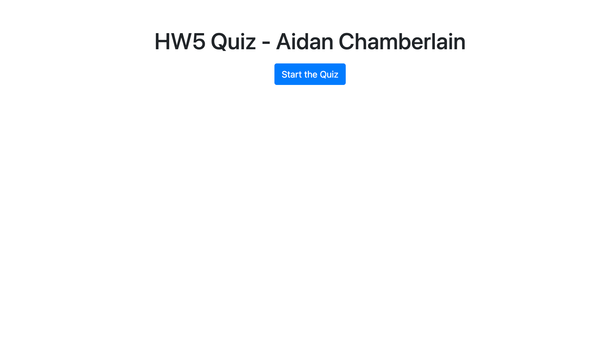
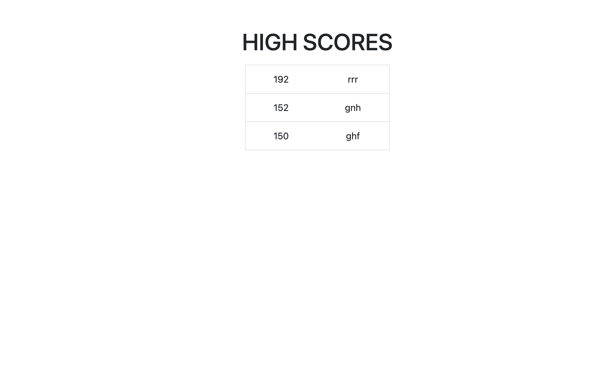

# hw4-code-quiz

## Description

A quiz where the user clicks a button to start the quiz. When the user start the quiz, the first question appears and a timer is shown and counts down the remaining time the user has to finish the quiz. Each time the user chooses an answer to a question, the user is told whether they chose correctly or not. If the user chose wrongly, time is subtracted from the remaining time. When the user has acknowledged the result of their choice, the next question is displayed. The quiz is over when all the questions have been answered OR the timer reaches 0. When the quiz is over, a score is calculated based on correct answers and time remaining. If the user's score is high enough to make it onto the high score board, it is added and the lowest score on the board is removed. The user can then choose if they wish the retake the quiz, or end. When the user decided to end, the high score board is displayed.

## Screenshot

## Links to Application

-   Here is the repo: [RedComet6/hw4](https://github.com/RedComet6/hw4-code-quiz)
-   Here is the pages: [RedComet6 hw4 Pages](https://redcomet6.github.io/hw3-password-generator/)
